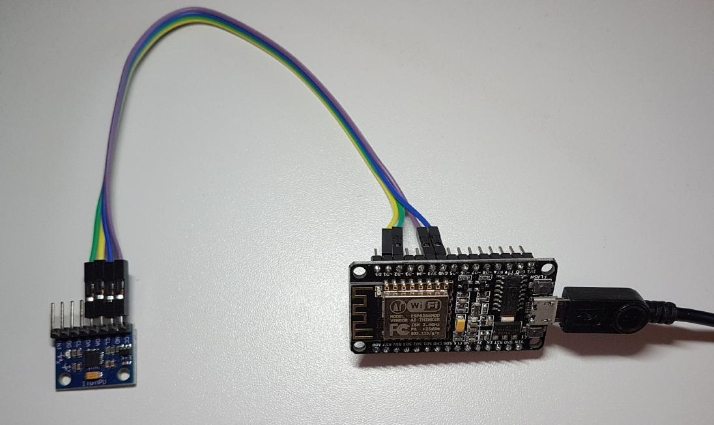
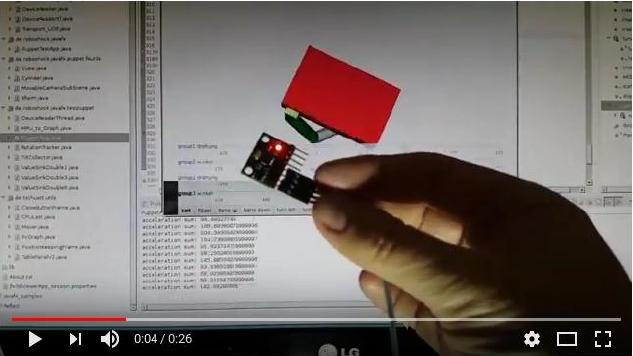

## Gyroscope sensor MPU-6050 to ESP-8266 to javafx

## About

Read from an MPU-6050 gyroscope sensor and visualize the rotations in a 3D scene with javafx.
This project is mainly written in java, and a small portion in "wire", the standard arduino programming language.

The extra hardware composes of

- gyro-acceleration-sensor MPU-6050 (costs around 5 EUR)
- microcontroller ESP8266 (with integrated WiFi), preferably the "Node MCU" (costs around 6 EUR)

Purposes:

1. You can see how to connect a gyro-acceleration-sensor to a computer via WiFi (UDP)
2. You can see which calculations of the sensor data are necessary to make them meaningful
3. You can see how to visualize a robot in javafx 3D

And ... you can do the calculations of the sensor data also without the graphical frontend.
 And ... you can try the javafx 3D visualization even without the extra hardware.
 

 

 
 

 

 
## Sensor fusion theory basics

There are already many good sites explaining the basics of gyro sensors and the MPU-6050 
and how to get some meaning out of the sensor readings. However, the most notable site 
for me is this one:
       http://www.geekmomprojects.com/gyroscopes-and-accelerometers-on-a-chip/

Please notice some important issues in the video at the end of the article.
Especially look at the right rectangle, which is the sensor fused one, and so
the best of the three.
At movie position 1:34: Heavy delayed correction (unfortuately mostly hidden by his arm).
At movie position 1:51: Heavy delayed following of the sensor movements.

These shortcomings are largely improved by the SW given here.

## Summary of the sensor fusion theory

The gyro readings have drift. So the robot orientation that was calculated on them need some 
correction now and then. (Another reason, why these rotations will always
add up with some error, is the the fact, that applying the rotations must actually happen
simultaniously, and not one by one.)

On the other hand, the accelerometer (and the tilt values derived from them) are unrestfull even during
no-movement phases, and can not be used at all during stronger movement. 
But they can be used for orientation correction now and then.

So we have to find clever ways to combine those two data. The result will be a hopefully good estimate 
of the robot orientation. 

The two main classes for this computation are `RotationTracker.java` and `TiltCollector.java`.

## Running the SW

1. Open the arduino sketch `MPU6050_to_ESP_WIFI.ino` in your arduino IDE
2. Set your WiFi name (wifi_ssid) and password (wifi_password), and upload it to your ESP-8266
3. Find out the IP assigned to your ESP board, either by opening the IDE serial monitor (115200 baud)
   (and probably resetting the ESP to replay the connect info) or under linux by something like this:  
`nmap -n -v -sP 192.168.0.100-125 \` `  |tr '\012' ' '|sed -e 's,Nmap , \nNmap,g'`
4. Open the java stuff in your java IDE 
5. Set the ESP IP address in `DeviceReaderThread` and then run `GyroPuppet.java`
 

## Background notes

### Integrated DMP vs. raw values

There are two different operation modes available with the MPU-6050. You can either 
read the raw acceleration and gyroscope values, or you can activate the chip integrated DMP
(digital motion processor) and read its output. However, it turned out that the DMP algorithm 
did not meet my expectations.
Especially the tilt corrections by acceleration data happen with to much delay. Therefore
I use the raw acceleration and gyroscope values only, and do the sensor fusion stuff by myself.
In the video below you can see, how fast and precise the virtual torso is following the 
sensor movements.

### Why UDP?

With TCP I excerienced some timing problems where communication freezed for 50 ms now and then. That is why I switched to UDP.
